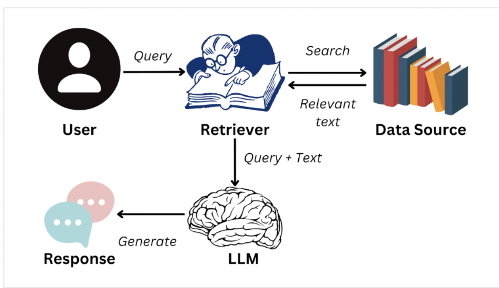

# Ollama: Advanced AI tool for setting up and running large language models locally.

Features:
- Local Language Model Execution: Run large language models locally for faster processing.
- Llama 2 Model: Utilize the powerful Llama 2 model for advanced natural language processing.
- Model Customization: Customize and create language models tailored to specific tasks.
- Easy Setup: User-friendly interface for quick setup and usage.

Platform Compatibility: Currently supports macOS, with Windows and Linux support coming soon.

How to Use:
1. Visit the official Ollama website and download the tool.
2. Install the tool on your macOS system.
3. Explore included language models or customize/create your own.

---

## LLM Challenges

LLMs face two primary challenges:
- Hallucinations: LLMs may produce false or nonsensical outputs.
- Lack of external sourcing: They can become outdated due to their reliance solely on internal data.

### What is RAG?
Retrieval Augmentation Generation (RAG) integrates the Natural Language Generation & Information Retrieval grounding language models with external knowledge sources for up-to-date information.

1. User input
2. Fetch the most similar document (as measured by our similarity measure)
3. Pass that into a prompt to the language model (prompt = user_input + relevant document)
4. Return the result to the user

---

## Jaccard Similarity

Jaccard similarity, named after the French mathematician Paul Jaccard, is a statistic used for comparing the similarity and diversity of sample sets. Jaccard Similarity Index (JSI) is also known as Intersection-Over-Union (IoU).

Sure, let's consider a simple example to explain Jaccard similarity. Suppose we have two sets:
Set A = {apple, banana, orange, mango}
Set B = {banana, kiwi, pineapple, mango}

To calculate the Jaccard similarity between these sets, we need to find the intersection and the union of the sets.
- Intersection of A and B = {banana, mango} (common elements in both sets)
- Union of A and B = {apple, banana, orange, mango, kiwi, pineapple} (all unique elements from both sets)

Now, we can calculate the Jaccard similarity coefficient:
J(A, B) = |A ∩ B| / |A ∪ B|
         = |{banana, mango}| / |{apple, banana, orange, mango, kiwi, pineapple}|
         = 2 / 6
         = 1/3 ≈ 0.333

So, the Jaccard similarity coefficient between sets A and B is approximately 0.333. This indicates that there is a 33.3% overlap or similarity between the two sets.

---

## Ten Potential Ways to Improve RAG Application

1. Document Quantity: Increasing the number of documents could lead to more recommendations.
2. Document Depth/Size: Enhanced content quality and longer documents with more information may improve recommendations.
3. Input to Language Model: Providing multiple documents as 'context' to the Language Model (LLM) could result in more personalized recommendations based on user input.
4. Document Chunking: Exploring options to feed parts of various documents or chunks of larger documents to the LLM.
5. Document Storage: Considering alternative storage methods or databases, such as data lakes or vector stores, especially for large document sets.
6. Similarity Measurement: Adjusting the method for measuring similarity to balance performance and thoroughness.
7. Pre-processing: Performing additional preprocessing or augmentation of user input before similarity measurement, such as converting it to a vector using embeddings.
8. Refining Similarity Measurement: Modifying the similarity measure to retrieve better or more relevant documents.
9. Model Selection: Experimenting with different models, such as Anthropic or Claude Models, in place of Llama2.
10. Prompt Variation: Using diverse prompts tailored to the desired output from the LLM/Model.
